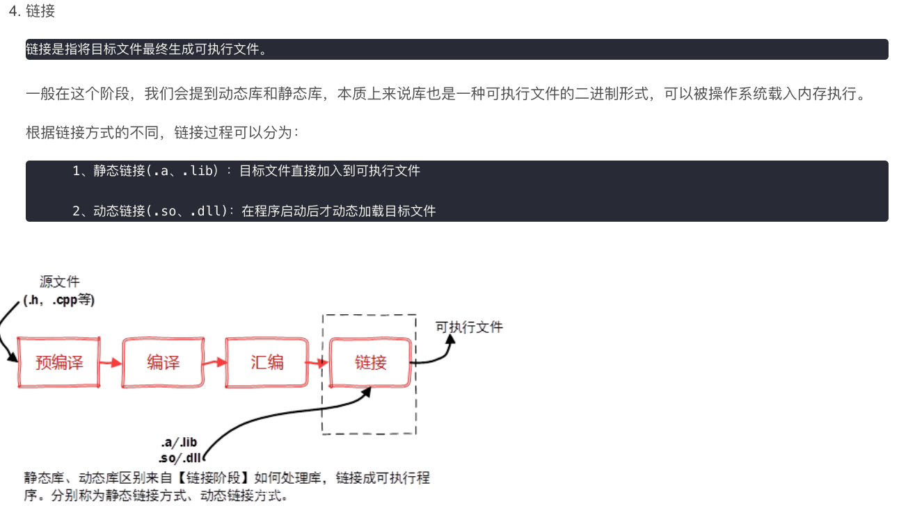

# C++

## 编译工具 gcc vs g++

## 编译过程

[https://blog.csdn.net/weixin\_38278334/article/details/113854362](https://blog.csdn.net/weixin\_38278334/article/details/113854362)

.png>)

.png>)

## 编译文件

| suffix |              |                                       |
| ------ | ------------ | ------------------------------------- |
| h      | /usr/include | header file                           |
| a      | /usr/lib     | static library                        |
| so     | /usr/lib     | shared library                        |
| dll    |              | shared library but different among os |

