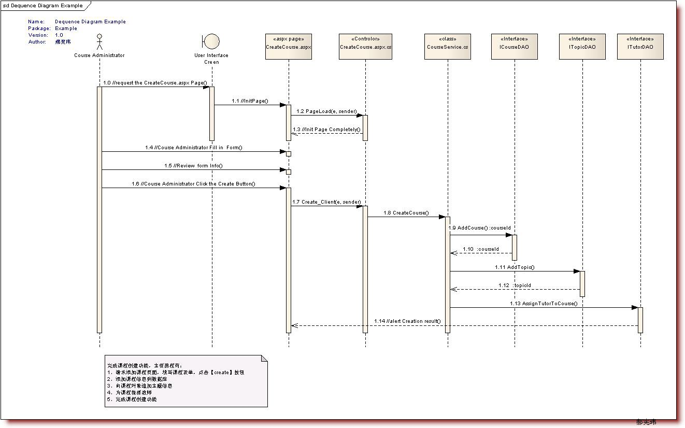

# Introduction

## License

.png>)

 (1).png>)

## Frameworks

| Framework | languages  | Company                    | 场景                         |
| --------- | ---------- | -------------------------- | -------------------------- |
| React     | JavaScript | Facebook、Instagram、Netflix | 社区活跃，JSX新语法，适用于大型应用和生态系统   |
| Vue       | JavaScript | 小米、阿里巴巴                    | 文档覆盖率高，Laravel集成，但市场份额相对匮乏 |
| Angular   | JavaScript | Google、Youtube、AWS         | Typescript语法复杂，迁移成本高       |

## Client/Server vs Browser/Server

|      | Client/Server               | Browser/Server              |
| ---- | --------------------------- | --------------------------- |
| 硬件环境 | 专用网络；胖用户/瘦服务器               | 广域网；瘦用户/胖服务器                |
| 安全要求 | 强                           | 弱                           |
| 程序架构 | 注重流程，系统运行速度较少考虑；点对点通信，响应速度快 | 安全及访问速度要多重考虑；多对多通信，响应速度相对较慢 |
| 代码重用 | 差                           | 好                           |
| 系统维护 | 难                           | 易                           |
| 处理问题 | 集中                          | 分散                          |
| 用户接口 | 与操作系统关系紧密                   | 跨平台，与浏览器相关                  |
| 信息流  | 中央集权，交互性低                   | 流向多变，交互密集                   |
| 场景   | 单一复杂的功能，如财政管理               | 通用性，逻辑事务相对较少                |

## OPP vs OOP

|    | 面向过程 OPP           | 面向对象 OOP                                                                                                                            |
| -- | ------------------ | ----------------------------------------------------------------------------------------------------------------------------------- |
| 特征 | 函数，流程化             | 抽象 封装 继承 多态                                                                                                                         |
| 步骤 | 分析问题>解决问题（细节>整体）   | 模型 > 抽象接口 > 接口设计>模块实现                                                                                                               |
| 目的 |                    | 可扩展性、可修改性、可替换性                                                                                                                      |
| 原则 |                    | 最小职责 SRP(类仅有一个引起变化的原因)；里氏替换 LSP（子类替换父类）；依赖倒置DIP（依赖抽象非具体）；最小接口LoD（多接口好于一通用接口）；开放封闭（实体可扩展不可修改）； 迪米特法则（两个类不直接发生相互作用）；组合/聚合（整体与部分，生命周期） |
| 优点 | 步骤清楚，效率高           | 结构清晰、易扩展、易维护                                                                                                                        |
| 缺点 | 代码重用性低、扩展能力差、维护难度大 | 开销大、性能低                                                                                                                             |

参考：[https://www.geeksforgeeks.org/strategy-pattern-set-1/](introduction.md)

### Document

|                   | 内容                              | 关系                                                                                 | 用途                                         |
| ----------------- | ------------------------------- | ---------------------------------------------------------------------------------- | ------------------------------------------ |
| 总体说明              | 背景、目标、意义、应用范围、文档组成              |                                                                                    |                                            |
| 用况图usecase        | 参与者与用况之间的关系                     | 关联（用户与用况，实线）、扩展（虚线箭头《extend》）、包含(虚线箭头《include》)、泛化(空心箭头的实线)                        | 捕获和描述系统需求、驱动整个开发过程、组织迭代周期、为了设计架构、编写用户手册的起点 |
| 类图 class          | 类、接口以及静态结构和关系                   | 泛化（继承、空心箭头的实线）、实现（类与接口、空心箭头的虚线）、关联（实心线）、聚合（部分可单独存在，空心菱形的实线）、组合（实心菱形的实线）、依赖（待箭头的虚线） | 应用程序的静态结构图                                 |
| 顺序图 sequence      | 横轴为对象，纵轴表时间，消息在对象间横向传递，依照时间纵向排列 | 元素：角色、对象、生命线、控制焦点、消息（同步、异步、返回）、自关联、组合片段                                            | 以时间顺序显示对象间的动态协作                            |
| 协作图 communication | 对象间的协作、交互关系                     | 元素：角色、对象、连接、消息                                                                     | 可与时序图进行转换，表示对象之间的关系                        |
| 状态图 State         | 对象具有的状态、转换、触发                   | 状态+迁移                                                                              | 精确地描述对象行为                                  |
| 活动图 Activity      | 工作流的图形化                         | 开始结束、分支判断、分叉与汇合                                                                    | 过程                                         |
| 构件图 Component     | 构件间的关系                          | 构件、接口、关系（依赖、实现）                                                                    | 可替换的物理部分                                   |
| 部署图 Deployment    | 系统的软、硬件拓扑                       | 结点（Node,物理元素）、物件（Artifact,开发过程产物）、连接（Association,通讯路径）                             | 描述物理组件、分布以及关联                              |

### usecase 用况图

### Class 类图

### Sequence 顺序图

### Communication 协作图

### State 状态图

### Activity 活动图

### Component 构件图

### Deployment 部署图

