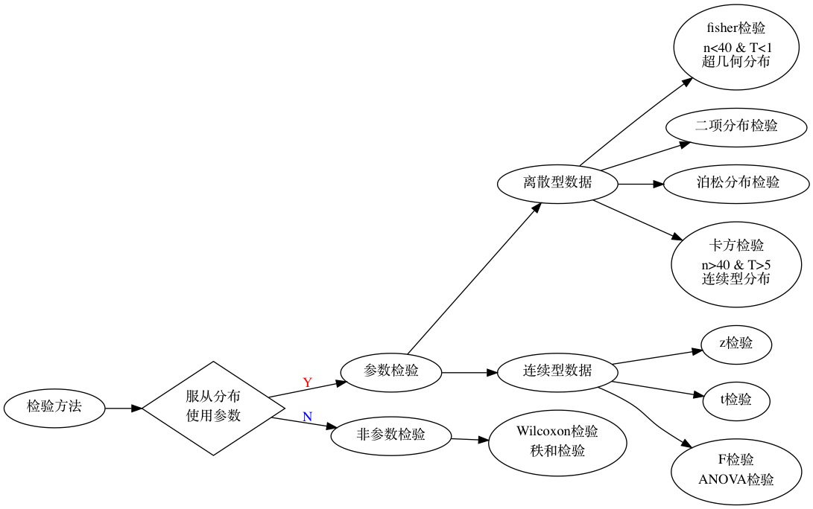

# testing

## 相关概念

### 标准差 s

$$
s = \sqrt{\frac{\sum{(x_i - \bar{x})}}{n-1}}
$$

### 置信区间 CI

$$
\bar{x} \pm Z_{\alpha/2} \frac{s}{\sqrt{n}}
$$

### 一类错误 

False Positive，弃真，原假设为真但拒绝了H0

$$
Type  I  error = P(统计量落入拒绝域|H_0) = \alpha
$$

### 二类错误

False Negative，存伪，原假设为假但接受了

$$
Type  II  error = P(统计量落入接受域|H_1) = \beta
$$

## 常见检验

| 检验方法 | 别名 | 分布 | 前提 | 检验内容 |
| :--- | :--- | :--- | :--- | :--- |
| z检验 | u检验 | 正态分布 | 样本量大于30 | 两组数据是否相等 |
| t | 学生检验 | 正态分布 | 小样本量小于30；方差齐性 | 两组数据是否相等 |
| 秩和检验 | Wilcoxcon检验 | 分布类型不明或呈偏态分布 |  | 两组数据是否相等 |
| fisher | 精确检验 | 超几何分布 | 2X2列联表：理论频数大于1, 样本量大于40 | 两种或多种处理方法的效果是否相同 |
| 卡方 | pearson | 连续型分布 | 2X2列联表：理论频数大于5, 样本量大于40pearson卡方;连续型矫正 | 两种或多种处理方法的效果是否相同 |
| F | ANOVA检验,方差检验 | 正态分布 | 方差齐；多样本两两比较：Q检验（Newman-keuls），多样本与对照两两比较：LSD法 | 某因素影响显著程度 |

## 正态检验

1. 概率密度图
2. QQ图
3. 经验

   68.3%: \[mean-1d,mean+1d\]  
   99.7%: \[mean-3d,mean+3d\]

4. 正态检验

| 正态检验方法 | 别名 | 原理 |
| :--- | :--- | :--- |
| Shapiro-Wilk | W检验 | 两个样本累积概率的最大差值 |
| Kolmogorov-Smirnov检验 | KS检验 | 经验累积概率与目标分布的累积概率之差的上界 |
| Anderson-Darling检验 | AD检验 | 经验累积概率和理论累积概率之差的积分 |
| Ryan-Joiner检验 | RJ检验 |  |

> 若数据不是正态分布，可考虑Box-Cox变换， Johnson变换

## 同质检验

* Bartlett’s test
* Levene’s test,数据偏离正态性时比Bartlett检验更稳定（鲁棒性更好）
* Fligner-Killeen test,这是一个非参数检验，数据偏离正态是非常稳定适用。

## 精确检验

适用情况：行×列表中不宜有1/5以上格子的理论数小于5，或有小于1的理论数, 或总观测频数小于40， 或者用卡方专用公式得到的p值和阈值（0.05）接近时

* 超几何分布：Fisher's exact test
* 二项式分布：Barnard's exact test
* 多项式分布：Barnard's exact test

## 卡方检验

* 任何一個欄位的期望次數小於5，會使「近似於卡方分配」的假設不可信，应做連續性修正。

## 多重检验校正

* Bonferroni校正：最严格，会导致假阴性增高

$$
q = \frac{p}{n}
$$

* FDR （false positive rate）：比较温和
  * Bonferroni-Hochberg 校正

$$
q = \frac{p}{rank} * n
$$

## python实现

scipy.stats，参考[https://segmentfault.com/a/1190000007626742](https://segmentfault.com/a/1190000007626742)

python数据分析：[https://pythonfordatascience.org/](https://pythonfordatascience.org/)

